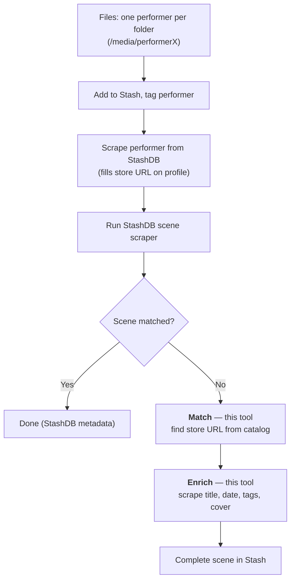

# clipstores-scraper

StashDB knows studio scenes. It does not know solo clips a performer sells on
IWantClips, ManyVids, Clips4Sale, etc.

This tool fills that gap: finds the clip-store URL for each unmatched scene,
writes it to Stash, then scrapes full metadata.

<!-- ci + coderabbit smoke test — this PR will be closed, not merged -->

## Workflow



Steps in words:

1. **Organize.** One performer per folder. Add to Stash.

   ```text
   /media/
   ├── Performer1/
   ├── Performer2/
   ├── Performer3/
   └── PerformerX/
   ```

2. **Assign the performer.** Each folder = one performer. In Stash, set that
   performer on **every scene in the folder** (bulk-edit the whole folder at
   once). So all scenes under `/media/Performer1` get Performer1, and so on.
   Then scrape the performer from their StashDB profile — this fills their
   "URLs" field with store links. That URL is what this tool reads.
3. **StashDB scene scraper.** Run it. StashDB-known scenes get identified.
4. **Match** (this tool). Leftover scenes — performer tagged, no StashDB id.
   Finds the store URL and writes it back.
5. **Enrich** (this tool). Scenes now have a store URL → scrape full metadata.

Match and enrich are a command or two each, or do it all in the
[dashboard](#dashboard).

## Setup

Needs [uv](https://docs.astral.sh/uv/).

```bash
uv sync
cp .env.example .env   # fill in STASH_URL and STASH_API_KEY
```

**Marker tag (recommended).** Create a tag in Stash, e.g. `clipstores-scraper`.
Find its id (Tags → the tag → number in its URL), set `CLIPSTORE_ENRICH_TAG` in
`.env`. Every enriched scene gets this tag — easy to filter for what this tool
touched. Unset = no tag.

## Match (step 4)

Scraping is headless and spans **every** performer with a supported store URL.
Results land in `state.db`; you review them and write the approved URLs from the
[dashboard](#dashboard).

```bash
uv run clipstores-scraper scrape               # scrape every un-scraped performer (parallel, resumable)
uv run clipstores-scraper scrape --ids 9999,8888   # scrape just these performers
uv run clipstores-scraper rescrape             # revisit scraped performers; fetch only new clips
uv run clipstores-scraper rescrape --ids 9999  # rescrape just this one
```

`--ids` is a comma-separated list of Stash performer ids; omit it for all. Both
commands are resumable: each performer is marked done as it finishes, so Ctrl-C
(or a crash) loses nothing — re-run to pick up the rest. A store URL comes from
each performer's "URLs" field, set when you scraped their StashDB profile.

Then open the [dashboard](#dashboard) (`uv run clipstores-scraper`, no args) to
review the matches: `enter`/`v` on a performer to approve or reject **pending**
ones (high-confidence matches are pre-approved), then press `A` to apply every
performer's approved URLs to Stash.

Why dump the whole catalog and match locally? Store search is unreliable. A
local catalog lets us cross-check duration + date — that's what makes
auto-linking safe.

## Enrich (step 5)

Enrich runs from the [dashboard](#dashboard): press `E` to scrape full metadata
for every linked scene and write it back.

Writes title, date, details, cover, code, and **all tags from every linked
store** (creates missing tags). Scene linked to several stores? Scalar fields
follow **IWantClips > ManyVids > Clips4Sale > LoyalFans**, lower stores fill
gaps. **Studio is guessed from the performer's other scenes** (store studio
names are inconsistent); no clear majority → left blank. Performer untouched.
Only scenes without a StashDB id are touched; each is tagged so re-runs skip it.
Scenes enrich in parallel and it's resumable — a re-run skips what's done.

## Dashboard

Run with no arguments to work across many performers at once:

```bash
uv run clipstores-scraper
```

Lists every performer with a supported store URL, their backlog, and
scrape/review state. Scrape, review, apply, enrich — one screen.

| key              | action                                                           |
| ---------------- | ---------------------------------------------------------------- |
| `t`              | triage/refresh performers from Stash (biggest backlog first)     |
| `s`              | full rescan of selected performer (ignores cache)                |
| `S` (or `b`)     | scrape all un-scraped performers (parallel; press again to stop) |
| `r`              | rescrape selected performer — only newly added clips             |
| `R`              | rescrape all scraped performers (parallel; again = stop)         |
| `l`              | open/close live scrape log                                       |
| `/`              | filter by name or store (esc to clear)                           |
| `enter` / `v`    | review selected performer's matches (approve / reject)           |
| `a`              | apply this performer's approved matches to Stash                 |
| `A`              | apply every performer's approved matches to Stash                |
| `E`              | enrich every linked scene                                        |
| `q` / `ctrl+c`×2 | quit                                                             |

State (performers, matches, decisions) lives in `state.db` — survives restarts,
re-scrapes never discard reviewed work. Rescrape is incremental (assumes newest
clips first). Want a full rebuild? Delete `cache/<store>/<id>.json`, scrape
again.

## Agentic matching

The deterministic matcher only auto-links when title + duration and/or date
agree. The "gray zone" it drops — renamed, abbreviated or censored titles, clips
with no duration — needs eyes on the cover image. The `scene-matcher` subagent
does exactly that, driven by these subcommands:

```bash
uv run clipstores-scraper performers --tag "[Monitored]"        # JSON: tagged performers + their stores
uv run clipstores-scraper candidates "<performer>"              # JSON worksheet of candidate clips (read-only)
uv run clipstores-scraper images <scene_id> <clip_url>          # both covers to /tmp for a side-by-side check
uv run clipstores-scraper link <scene_id> <clip_url> [--enrich] # write the URL to Stash (unioned, never clobbers)
```

`<performer>` is a Stash id or a unique name/alias substring. In Claude Code, ask
the **scene-matcher** subagent to match a performer: it scrapes the worksheet,
compares covers, and writes only the rows you approve (`--enrich` also pulls full
metadata). `link` is the only command here that writes.

## Stores

| Store                              | Method                  |
| ---------------------------------- | ----------------------- |
| IWantClips                         | HTTP (Typesense + HTML) |
| ManyVids                           | HTTP (JSON)             |
| Clips4Sale                         | HTTP (JSON)             |
| LoyalFans                          | HTTP (JSON)             |
| APClips                            | HTTP                    |
| goddesssnow.com                    | HTTP (HTML)             |
| brookelynnebriar.com (ModelCentro) | HTTP (JSON API)         |

Last two are single-performer self-hosted sites. ModelCentro/AdultCentro powers
many of them — register one `ModelCentroStore("<domain>")` per site in
`REGISTRY`.

Add a store = one module in `src/clipstores_scraper/stores/` implementing
`StoreScraper`, appended to `REGISTRY`. Rest of the pipeline is store-agnostic.
All plain HTTP, no browser. Run behind a VPN so traffic comes from a residential
IP — the scraper handles no proxies itself.

## Development

```bash
uv run ruff check .
uv run ruff format .
```
